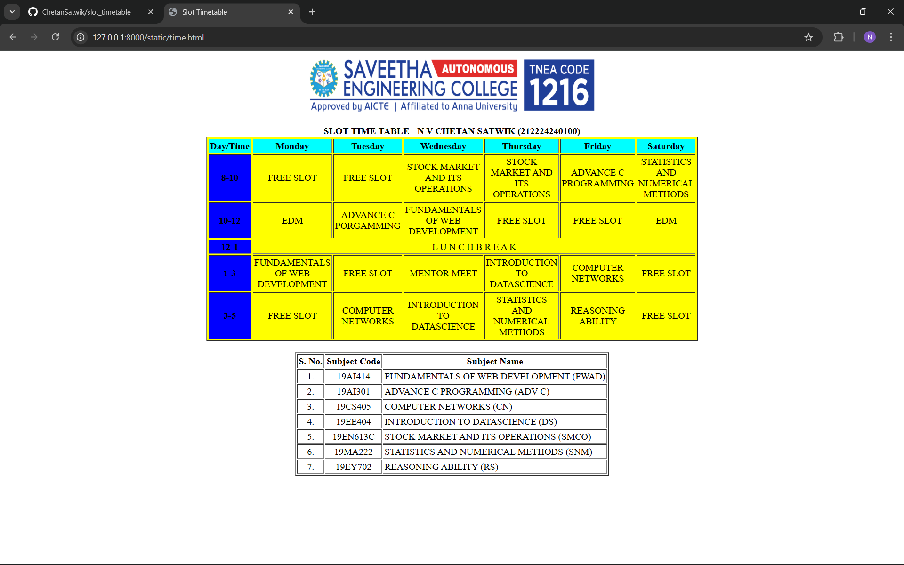

# Ex03 Time Table
## Date: 29-09-2007

## AIM
To write a html webpage page to display your slot timetable.

## ALGORITHM
### STEP 1
Create a Django-admin Interface.

### STEP 2
Create a static folder and inert HTML code.

### STEP 3
Create a simple table using ```<table>``` tag in html.

### STEP 4
Add header row using ```<th>``` tag.

### STEP 5
Add your timetable using ```<td>``` tag.

### STEP 6
Execute the program using runserver command.

## PROGRAM
```
<html>
<head>
<title>Slot Timetable</title>
</head>
<body>
<center>

</center>
<br>
<table align="center" width="500" cellspacing="3" cellpadding="2" border="2" bgcolor="yellow">
<caption><b>SLOT TIME TABLE - N V CHETAN SATWIK (212224240100)</b></caption>
<tr align="center">
<th bgcolor="cyan">Day/Time</th>
<th bgcolor="cyan">Monday</th>
<th bgcolor="cyan">Tuesday</th>
<th bgcolor="cyan">Wednesday</th>
<th bgcolor="cyan">Thursday</th>
<th bgcolor="cyan">Friday</th>
<th bgcolor="cyan">Saturday</th>
</tr>
<tr align="center">
<th bgcolor="BLUE">8-10</th>
<td>FREE SLOT</td>
<td>FREE SLOT </td>
<td>STOCK MARKET AND ITS OPERATIONS</td>
<td>STOCK MARKET AND ITS OPERATIONS</td>
<td>ADVANCE C PROGRAMMING</td>
<td>STATISTICS AND NUMERICAL METHODS</td>
</tr>
<tr align="center">
<th bgcolor="BLUE">10-12</th>
<td>EDM</td>
<td>ADVANCE C PORGAMMING</td>
<td>FUNDAMENTALS OF WEB DEVELOPMENT</td>
<td>FREE SLOT</td>
<td>FREE SLOT</td>
<td>EDM</td>
</tr>
<tr>
<th bgcolor="BLUE">12-1</th>
<td colspan="6" align="center">L U N C H    B R E A K </td>
</tr>
<tr align="center">
<th bgcolor="BLUE">1-3</th>
<td>FUNDAMENTALS OF WEB DEVELOPMENT</td>
<td>FREE SLOT</td>
<td>MENTOR MEET</td>
<td>INTRODUCTION TO DATASCIENCE</td>
<td>COMPUTER NETWORKS</td>
<td>FREE SLOT</td>
</tr>
<tr align="center">
<th bgcolor="BLUE">3-5</th>
<td>FREE SLOT</td>
<td>COMPUTER NETWORKS</td>
<td>INTRODUCTION TO DATASCIENCE</td>
<td>STATISTICS AND NUMERICAL METHODS</td>
<td>REASONING ABILITY</td>
<td>FREE SLOT</td>
</tr>
</table>
<br>
<table align="center" cellspacing="2" cellpadding="2" border="2">
<tr align="center">
<th>S. No.</th>
<th>Subject Code</th>
<th>Subject Name</th>
</tr>
<tr>
<td align="center">1.</td>
<td align="center">19AI414</td>
<td>FUNDAMENTALS OF WEB DEVELOPMENT (FWAD)</td>
</tr>
<tr>
<td align="center">2.</td>
<td align="center">19AI301</td>
<td>ADVANCE C PROGRAMMING (ADV C)</td>
</tr>
<tr>
<td align="center">3.</td>
<td align="center">19CS405</td>
<td>COMPUTER NETWORKS (CN)</td>
</tr>
<tr>
<td align="center">4.</td>
<td align="center">19EE404</td>
<td>INTRODUCTION TO DATASCIENCE (DS)</td>
</tr>
<tr>
<td align="center">5.</td>
<td align="center">19EN613C</td>
<td>STOCK MARKET AND ITS OPERATIONS (SMCO)</td>
</tr>
<tr>
<td align="center">6.</td>
<td align="center">19MA222</td>
<td>STATISTICS AND NUMERICAL METHODS (SNM)</td>
</tr>
<tr>
<td align="center">7.</td>
<td align="center">19EY702</td>
<td>REASONING ABILITY (RS)</td>
</tr>
</table>
</body>
</html>
```

## OUTPUT


## RESULT
The program for creating slot timetable using basic HTML tags is executed successfully.
